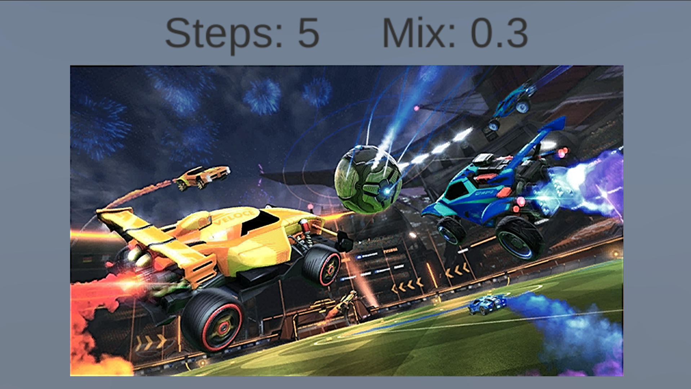
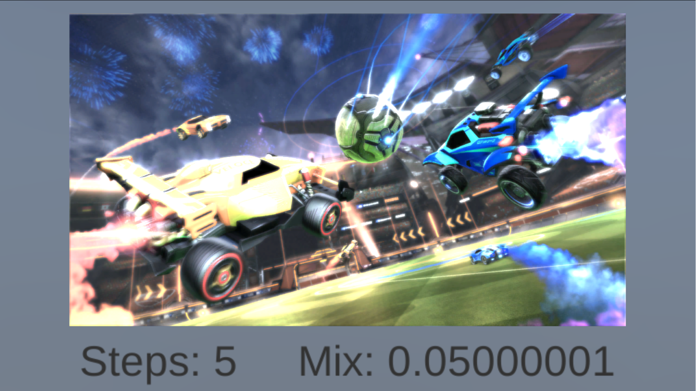

# Unity 3D Kernel Demo

A demonstration of image processing using kernel transformations in Unity 3D. Two different image kernels are used in this project, one to blur an image using a Gaussian Blur approximation, and one to sharpen an image. The kernel transformations are applied using CG/HLSL shaders. Hosted at https://peroshki.github.io/Unity-Image-Kernels/

## Controls
| Key        | Action           |
| ------------- |:-------------:|
| Up/Down Arrow      | Increase/Decrease Step |
| Left/Right Arrow      | Increase/Decrease Mix      |
| W/A/S/D | Move Camera     |
| Z/X      | Zoom In/Out |

## Tips
* Avoid using fullscreen to prevent the UI from acting strange.

* The Blur filter looks best at around 0.03 to 0.1 Mix.

* The Sharpen filter looks best at around 0.3 to 0.5 Mix.

## Screenshots

->Center<-

